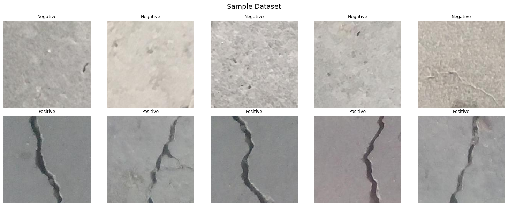
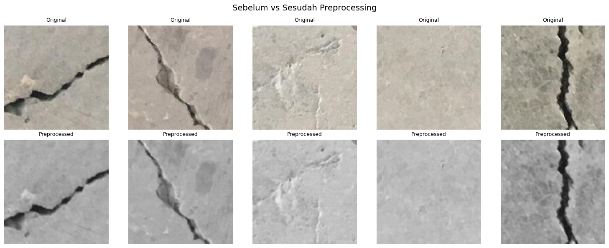
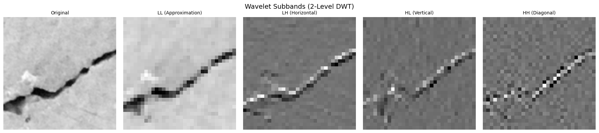
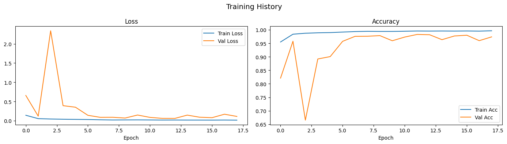
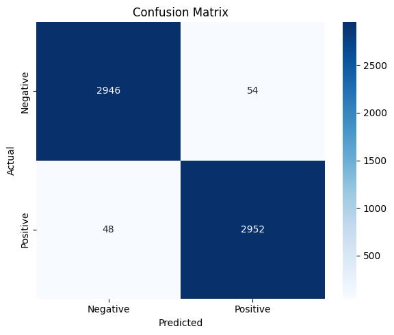
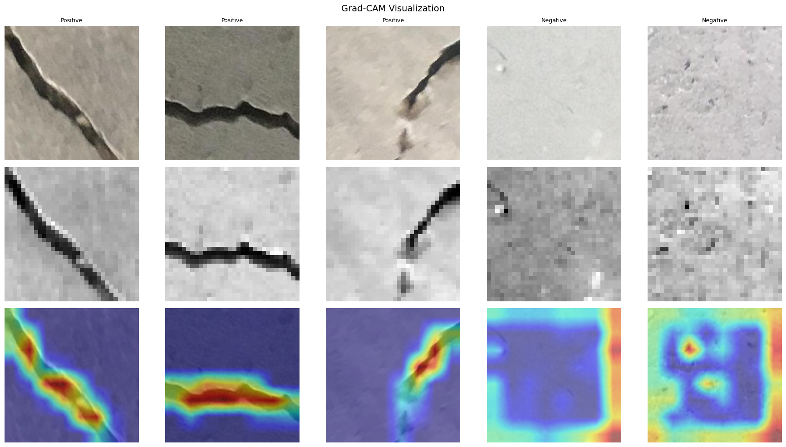

# Krak.AI — Real-Time Surface Crack Detection with Wavelet-CNN

A full-stack web application for detecting surface cracks on concrete and structural surfaces using Discrete Wavelet Transform (DWT) preprocessing and a lightweight CNN architecture, with real-time inference via webcam and Grad-CAM visual explanations.

## Live Demo

- **Frontend (web app)**: https://krak-ai.vercel.app
- **Backend (API docs)**: https://devaaldo-krak-ai-backend.hf.space/docs

> The backend runs on Hugging Face Spaces' free tier and may sleep after inactivity — the first request can take ~30 seconds to wake up.

## Overview

Krak.AI combines signal processing and deep learning to automate structural surface inspection. The system applies two-level Haar Wavelet Transform to decompose images into frequency sub-bands, then feeds these into a custom lightweight CNN for binary classification (crack / no crack). Grad-CAM overlays provide interpretable visual feedback, highlighting the exact regions driving each prediction.

## Architecture

```
Input Image --> Grayscale + Resize (128x128)
            --> 2-Level Haar DWT (LL, LH, HL, HH sub-bands)
            --> LightCrackCNN (Conv3 + BN + ReLU + GAP)
            --> Softmax Classification
            --> Grad-CAM Heatmap Overlay
```

### Key Technical Details

- **Preprocessing**: 2D Discrete Wavelet Transform (Haar) extracts 4-channel frequency sub-bands, emphasizing high-frequency edge features of cracks while suppressing noise.
- **Model**: Custom lightweight CNN (LightCrackCNN) with 3 convolutional blocks, batch normalization, and global average pooling. Total parameters ~24K.
- **Explainability**: Grad-CAM visualization on the final convolutional layer provides spatial attribution maps for each prediction.
- **Inference**: Sub-50ms per frame on CPU, enabling real-time detection at 10 FPS via WebSocket streaming.

## Tech Stack

| Layer       | Technology                                  |
|-------------|---------------------------------------------|
| Frontend    | React 19, Vite 8, Framer Motion             |
| Backend     | FastAPI, WebSocket                           |
| ML Pipeline | PyTorch, PyWavelets, OpenCV                  |
| Model       | LightCrackCNN (custom architecture)          |
| Notebook    | Jupyter (training, evaluation, experiments)  |

## Features

- **Image Upload**: Upload structural images for single-frame crack detection with confidence scores and Grad-CAM overlay.
- **Live Webcam Detection**: Stream camera feed via WebSocket for continuous real-time crack detection with FPS monitoring.
- **Grad-CAM Visualization**: Interpretable heatmap overlay showing which regions of the image activated the model's prediction.
- **Responsive UI**: Modern interface with page transitions, scroll animations, and interactive components.

## Results

### Dataset Samples



*Top row: Negative (no crack). Bottom row: Positive (crack detected).*

### Preprocessing Pipeline



*Left: original RGB images. Right: after grayscale conversion, resize to 128×128, and normalization.*

### Wavelet Sub-bands (2-Level DWT)



*From left: original grayscale, LL (approximation), LH (horizontal edges), HL (vertical edges), HH (diagonal edges).*

### Training History



*Best validation accuracy reached at epoch 12 (98.27%). Early stopping triggered at epoch 18.*

### Evaluation — Confusion Matrix



### Grad-CAM Visualization



*Row 1: original images. Row 2: preprocessed. Row 3: Grad-CAM overlay showing crack regions.*

## Project Structure

```
.
├── backend/
│   ├── main.py              # FastAPI server (REST + WebSocket)
│   ├── model.py             # LightCrackCNN, DWT preprocessing, Grad-CAM
│   └── best_model.pth       # Trained model weights
├── frontend/
│   ├── src/
│   │   ├── pages/           # Home, Live, Import, About, Projects
│   │   ├── components/      # Navbar, Footer, Layout, animation components
│   │   └── App.jsx          # Router configuration
│   └── package.json
├── notebook/
│   └── crack-detection.ipynb  # Training and evaluation notebook
├── docs/
│   └── assets/              # Notebook result images
├── requirements.txt
└── .gitignore
```

## Getting Started

### Prerequisites

- Python 3.10+
- Node.js 18+

### Backend

```bash
cd backend
python -m venv .venv
.venv\Scripts\activate        # Windows
source .venv/bin/activate     # Linux / macOS
pip install -r ../requirements.txt
uvicorn main:app --reload --port 8000
```

### Frontend

```bash
cd frontend
npm install
npm run dev
```

The frontend runs at `http://localhost:5173` and communicates with the backend at `http://localhost:8000`.

## Deployment

Both halves are deployed on free tiers:

| Part     | Platform              | Notes                                                                                  |
|----------|-----------------------|----------------------------------------------------------------------------------------|
| Frontend | **Vercel**            | Root Directory `frontend`; set env vars `VITE_API_URL` & `VITE_WS_URL`, then redeploy.  |
| Backend  | **Hugging Face Spaces** | Docker SDK, port `7860` (see `backend/Dockerfile` + `backend/README.md`). A `git push` triggers a rebuild. |

After deploying, allow the frontend origin on the backend by setting the `FRONTEND_ORIGINS` env var (Space → Settings → Variables) to the Vercel URL, e.g. `https://krak-ai.vercel.app`.

## API Endpoints

| Method    | Endpoint   | Description                                         |
|-----------|------------|-----------------------------------------------------|
| POST      | /predict   | Upload image, returns label + confidence + Grad-CAM |
| WebSocket | /ws        | Stream frames, receive real-time predictions         |
| GET       | /          | Health check                                         |

## Dataset

Training was performed on the [Surface Crack Detection Dataset](https://www.kaggle.com/datasets/arunrk7/surface-crack-detection) from Kaggle, containing 40,000 images of concrete surfaces (20,000 positive, 20,000 negative). Split 70/15/15 for train/val/test.

